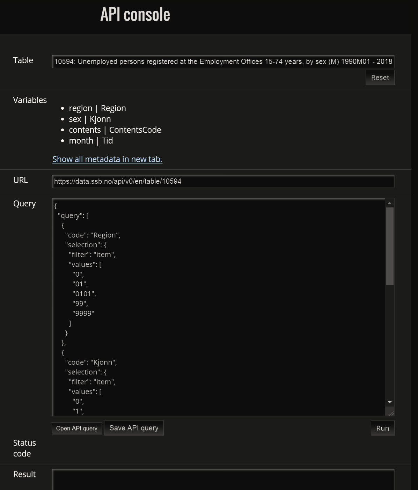

```{r setup, include=FALSE}
#Set default option of code-block to show code. 
#include=FALSE makes it not show up in html-notebook. 
knitr::opts_chunk$set(echo = TRUE)
```

```{r libraries, include=FALSE}
#Load all relevant packages.
library("checkpoint") #Checkpoint assures us that we use the same package versions
checkpoint("2019-01-21") #As they were at the date set in this function. i.e "2019-01-21"
library(here) # allows us to use relative file paths, see readme or simulations doc
library(httr) #Tools for Working with URLs and HTTP
library(rjstat) #Read and Write 'JSON-stat' Data Sets
library(readxl) #reading excel-files
library(stargazer) #For summary statistics
```
##Introduction

This is the first document on a series on how to make interactive figures and tables using Shiny apps and dashboards, using the Statistics Norway (SSB) API and other online sources. We have done our utmost to keep all sources in English, but let us know if you find mistakes. It is also easy to get the Norwegian sources by removing /en/ in SSB links. 

We will use 4 datasets. The three first datasets are from the Statistics Norway API. We will use the API to get data on unemployment, number of inhabitants and average sales prices of real estate home transaction prices for the four biggest cities in Norway, namely Oslo, Bergen, Stavanger and Trondheim. The datasets have a five digit code-number for identification. We will further add the oil price by the Europe Brent spot price from [U.S. Energy Information Administration](https://www.eia.gov/). 

####Datasets
* 10594: 1990-2018, monthly, unemployment by gender, municipality level
* 07459: 9186-2018, quarterly, population by age and gender, municipality level
* 06726: 1992-2017, monthly, Transfers of dwelling properties with building, free market sale, by number, purchase price, municipality level
* EIA.gov Brent Spot price FOB in dollars per barrel

##Data from SSB
There are several ways to access data from Statistics Norway. The first option is to go through their statistics database [StatBank](https://www.ssb.no/en/statbank). This is sometimes a good place to start looking for data. Second, you can use their API <https://www.ssb.no/en/omssb/tjenester-og-verktoy/api>. The API allows for much more flexibility in generating datasets, as well as it is a good way to get the newest numbers, you simply have to re-run your code. A final convenient resource is the SSB archive of official classifications, available at <https://www.ssb.no/en/klass/>. 
 

If navigate to the API through the previous link, choose 'API: Create your own datasets'. Note that the documentation in the API is somewhat scarce, so we reccomend viewing the data in the StatBank first. The third and final useful resource is the official classification lists of SSB, available at: <https://www.ssb.no/en/klass/>. 

####First dataset (10594)

Allright, navigate to the API page <https://www.ssb.no/en/omssb/tjenester-og-verktoy/api>. Choose 'API: Create your own datasets' and you will see the API console. If you type in three characters, autofill will provide you with relevant suggestions. Let us input the identifier '10594' to get the numbers on unemployment. This should result in the console looking as below. 



```{r, include = FALSE}
#Note that the syntax of Markdown is different from the syntax of R, so that the
#Relative file path is relative to the RMD file and not the PROJ file, so that we
#need ../ to get the picture saved in figures (of course depending on RMD location)
```

Allright, so we have found and chosen table 10594: Unemployed persons registered at the Employment Offices. 'Variables' gives a brief description of the variables in the dataset. You can also show all the metadata, however this is not very useful other than that you see that there are lots and lots of regions (country, counties and municipalities) and time periods. This can of course be useful, but there is no simple way do discern that 0118 is the municipality of Aremark. A convenient way to figure this out is the Statbank. If you find the corresponding table there, in this case at <https://www.ssb.no/statbank/table/10594> you can browse through it and simply find 0118 Aremark. Alternatively, you can search the Statistical Classifications and Codelists <https://www.ssb.no/en/klass/> for 'municipality' and find 'Classification of municipalities' and again confirm that 0118 is Aremark. Note however that for instance Trondheim has the code 5001 AND 1601, and for instance in the unemployment statistics 1601 is used up until 2017,but for 2018 the code 5001 is used. This is easy to spot when looking at the StatBank. 

After variables and metadata comes the URL. This is a stable permanent URL to the data, which we need to load the data from R. 

Then comes the interesting part, the query. The query can be copy pasted into your code and is ready to use. Note however, that by default it only gives you a subset of the data, so the query must be modified. 

The first thing we want to chage is the region. We are only interested in Oslo, Bergen, Trondheim and Stavanger. From the StatBank or the municipality classifications lists we get that the the codes are: 

* Oslo 0301
* Stavanger 1103
* Bergen 1201
* Trondheim 1601 (5001)

The code for choosing regions looks by default like: 

      "code": "Region",
      "selection": {
        "filter": "item",
        "values": [
          "0",
          "01",
          "0101",
          "99",
          "9999"
        ]
      }
      
We want to replace that with our regions: 

      "code": "Region",
      "selection": {
        "filter": "item",
        "values": [
          "0301",
          "1103",
          "1201",
          "1601"
        ]
      }

Further, by default SSB only gives us five time-observations, but we want all of them. The default part of the code looks like: 

      "selection": {
        "filter": "item",
        "values": [
          "1990M01",
          "1990M02",
          "1990M03",
          "2017M11",
          "2018M11"
        ]
      }

Now to get all observations, we change filter from "item" to "all" and use "*" in the values part. This changes the code to: 

        "selection": {
        "filter": "all",
        "values": [
        "*"
        ]
        }

So let's try it out!      

```{r}
#First we need to declare the URL from the API Console
url_10594 <- "https://data.ssb.no/api/v0/en/table/10594"

#Then we wrap the query in df_10594 by df_10594 <- '*insert query*'
#Remember to change the filters

query_10594 <- '
{
  "query": [
    {
      "code": "Region",
      "selection": {
        "filter": "item",
        "values": [
          "0301",
          "1103",
          "1201",
          "1601"
        ]
      }
    },
    {
      "code": "Kjonn",
      "selection": {
        "filter": "item",
        "values": [
          "0",
          "1",
          "2"
        ]
      }
    },
    {
      "code": "ContentsCode",
      "selection": {
        "filter": "item",
        "values": [
          "Registrerte1"
        ]
      }
    },
    {
      "code": "Tid",
      "selection": {
        "filter": "all",
        "values": [
          "*"
        ]
      }
    }
  ],
  "response": {
    "format": "json-stat2"
  }
}
'

#POST send the query to the URL provided. We store the results in temp        
temp <- POST(url_10594 , body = query_10594, encode = "json", verbose())
#use: ', verbose()' to see what goes on under the hood, alternatively:
#str(temp) #Is useful to see what comes back

# create dataframe of results by using fromJSONstat which extracts the results 
df_10594 <- fromJSONstat(content(temp, as ="text"), use_factors = TRUE)

```

And that's it! Note the output states that HTTP/1.1 200 OK, which means the extration was succesful. You now have a dataframe will all the specified data. Let us now take a look at the data we have loaded. 

```{r}
str(df_10594)

#Let us then take a look at the missing values
df_10594[is.na(df_10594$value),]

```

By extracting the rows with missing values we see that there are three of them. They are all from Trondheim and in 2018. This is due to the previous issue of Trondheim being classified both as 1601 and 5001. We have however looked at the StatBank and know their true numbers and will replace them. This is a bith hacky and normally we would merge the two tables, but to save some code we will do it simple. 

```{r}
df_10594$value[df_10594$region == "Trondheim (-2017)" & df_10594$sex == "Both sexes" & df_10594$month == "2018M11"] <- 2076
df_10594$value[df_10594$region == "Trondheim (-2017)" & df_10594$sex == "Males" & df_10594$month == "2018M11"] <- 1214
df_10594$value[df_10594$region == "Trondheim (-2017)" & df_10594$sex == "Females" & df_10594$month == "2018M11"] <- 862
 
#Save raw data
#saveRDS(df_10594, file = here("data/raw", "df_10594.rds"))
```


#### Second dataset 07459: Population, by sex and one-year age groups

There are alternatives to copy pasting the query, for instance by downloading the JSON file from the console. Some people might also like the code more condensed (which you will find in the JSON file). However, you might want to look into code-folding or separating the code into multiple files and source it instead. Nevertheless, the code below comes from the downloaded JSON-file and is more condensed. Instead of copy paste this can be done by: fromJSON(file = "downloadedfile.json") 


Remember filtering for region and time period, as well as age (alder)

```{r}
#First we need to declare the new URL from the API Console

url_07459 <- "https://data.ssb.no/api/v0/en/table/07459"

#Then we wrap the query in df_07459 by df_07459 <- '*insert query*'
#Remember to change the filters

data_07459 <- '
{"query":[{"code":"Region","selection":{"filter":"item","values":["0301","1103","1201","1601"]}},{"code":"Kjonn","selection":{"filter":"item","values":["1","2"]}},{"code":"Alder","selection":{"filter":"all","values":["*"]}},{"code":"ContentsCode","selection":{"filter":"item","values":["Personer1"]}},{"code":"Tid","selection":{"filter":"all","values":["*"]}}],"response":{"format":"json-stat2"}}
'

# Make object with POST function
#POST send the query to the URL provided. We store the results in temp        
temp <- POST(url_07459 , body = data_07459, encode = "json")
#str(temp) #Is useful to see what comes back

# create dataframe by using fromJSONstat which extracts the results 
df_07459 <- fromJSONstat(content(temp, as ="text"), use_factors = TRUE)

#Find missing values
missing_df <- df_07459[is.na(df_07459$value),]
missing_df

#No missing

#Finally, let us save the raw data 

#saveRDS(df_07459, file = here("data/raw", "df_07459.rds"))


```


#### Third dataset 06726: Transfers of dwelling properties with building, free market sale, by number, purchase price and average purchase 

Remember filtering on region and time period. Also, the variable "GjSum" (average sum) has a lot of missing and can be calculated by the two other variables, so we remove it. 

```{r}
#First we need to declare the new URL from the API Console

url_06726 <- "https://data.ssb.no/api/v0/en/table/06726"

#Then we wrap the query in df_07459 by df_07459 <- '*insert query*'
#Remember to change the filters

data_06726 <- '
{"query":[{"code":"Region","selection":{"filter":"item","values":["0","0301","1103","1201","1601"]}},{"code":"ContentsCode","selection":{"filter":"item","values":["Oms","Kjopesum"]}},{"code":"Tid","selection":{"filter":"all","values":["*"]}}],"response":{"format":"json-stat2"}}
'

# Make object with POST function
#POST send the query to the URL provided. We store the results in temp        
temp <- POST(url_06726 , body = data_06726, encode = "json")
#str(temp) #Is useful to see what comes back

# create dataframe by using fromJSONstat which extracts the results 
df_06726 <- fromJSONstat(content(temp, as ="text"), use_factors = TRUE)

#Find missing values
missing_df <- df_06726[is.na(df_06726$value),]
missing_df

#No missing

#Finally, let us save the raw data 

#saveRDS(data_06726, file = here("data/raw", "data_06726.rds"))


```

#### Fourth dataset

The Europe Brent Spot Price FOB can be downloaded as an Excel-file from <https://www.eia.gov/dnav/pet/hist/LeafHandler.ashx?n=PET&s=RBRTE&f=M>. However, there is an easier way. By copying the link-file (not the one above), using the GET command we can load it directly from R. If the file us updated, we can simply run the code for the newest numbers. 

```{r}

GET("https://www.eia.gov/dnav/pet/hist_xls/RBRTEm.xls", write_disk(tf <- tempfile(fileext = ".xls")))

df_europe_brent_spot <- read_excel(tf,
                 col_names = c("date","price"), #Set custom col-names as we load without
                 skip=3, #Skip the top three rows as they are info and messes with format
                 sheet = "Data 1") # Set sheet to where data is
str(df_europe_brent_spot)

```


